## Descrição
- Malware baseado na técnica [DirtyVanity](https://www.deepinstinct.com/blog/dirty-vanity-a-new-approach-to-code-injection-edr-bypass)
- Aloca um [Position Independent Shellcode](https://www.youtube.com/watch?v=4spiZScwCOU) e executa em memória via reflection
- Este malware também faz uso do `cryptoxor`

___
## Hospedagem
- Hospedar o shellcode (e a imagem, que é a mesma utilizada no `criptoxor`) na C2
- Para gerar o `redsc` é só copiar o arquivo `loader` com este nome. O arquivo loader é gerado pelo `criptoxor`

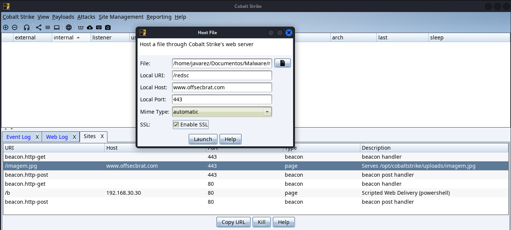

___

## Compilação
- Se o malware `Cardinal` não estiver compilado, executar:

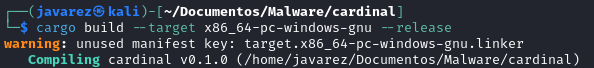

-  É comum que dê alguns alertas, mas não tem problema, porque compilará corretamente com a seguinte mensagem:

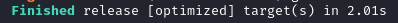

___

## Criação do PIC (Position Independent Code)
- Para facilitar o entendimento, assistir o vídeo [Position Independent Shellcode](https://www.youtube.com/watch?v=4spiZScwCOU)
- O primeiro passo é clonar o projeto do Dirty Vanity para o Windows

### Configurações Visual Studio
- No Visual Studio Installer, é preciso adicionar os SDK de Windows 10. Também tudo que de suporte ao MSVC v141 (Os Espectro não precisa). Para isto, basta abrir o Visual Studio Installer > clicar em modificar > clicar em componentes independentes > procurar v141 e adicionar todos os componentes que sejam x64/x86 (Sem ser os Espectro)
- Assim, ao abrir o Visual Studio com o projeto do Dirty Vanity, poderemos escolher as configurações corretas que seguem abaixo:

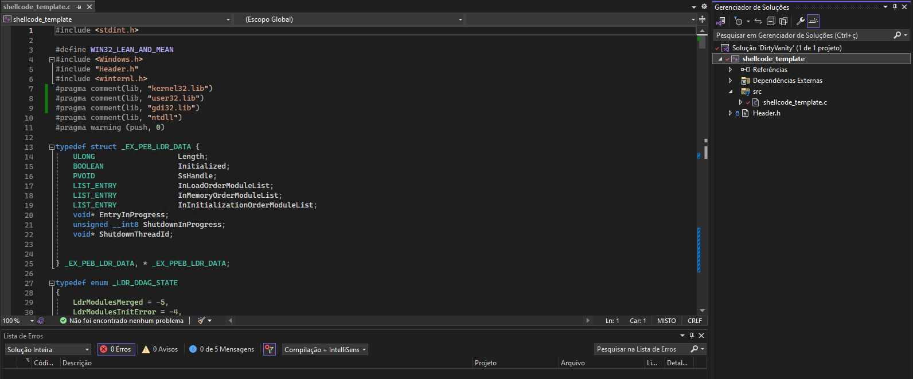

- Para abrir as configurações, basta clicar no projeto e clicar com botão direito na janela em branco, abaixo do Header.h. Agora é só configurar:

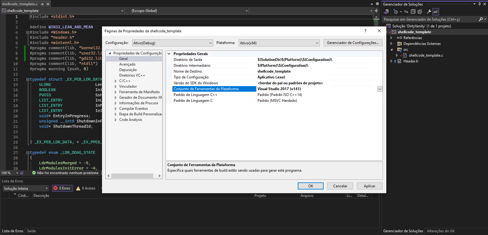

- Selecione Visual Studio 2017. Clicando em `Aplicar` já irá corrigir os erros e você poderá alterar o SDK.

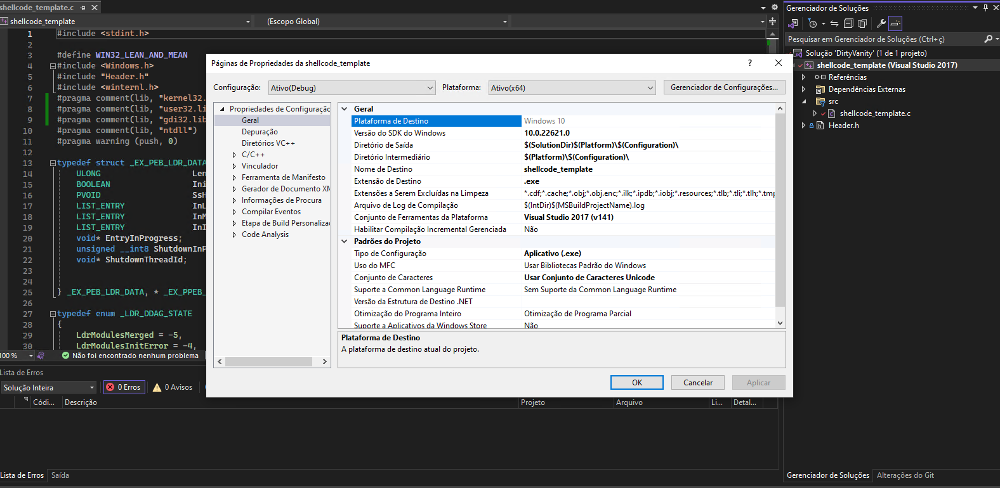

- Agora o resto pode deixar padrão, mas garanta que estará como abaixo. Se não estiver, coloque `<herdar do pai>`:

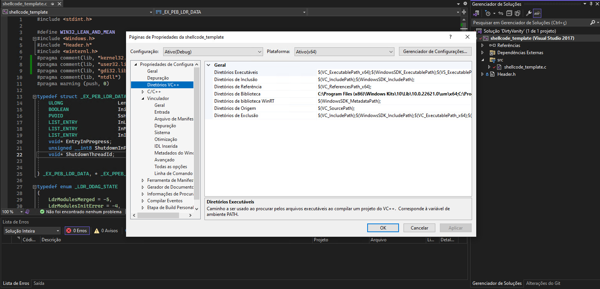

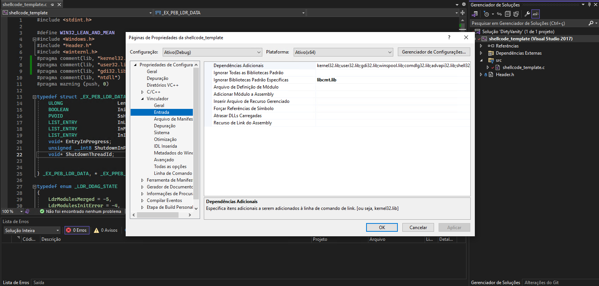

### Criação do Shellcode
- Na linha comentada com `// load wide \\??\\C:\\Windows\\System32\\cmd.exe` é onde temos que fazer as alterações. Também precisaremos alterar `// load wide \\??\\C:\\Windows\\System32\\cmd.exe /k msg * Hello from Dirty Vanity`. Para isto, vamos usar o código `hexa.py`
- Primeiro precisamos saber qual comando utilizaremos, e para o contexto de uma execução do cobalt strike, temos que utilizar uma execução de powershell com IEX, assim, usaremos o `hexa.py` para criar uma string separada em 4bytes para serem anexados no campo citado:

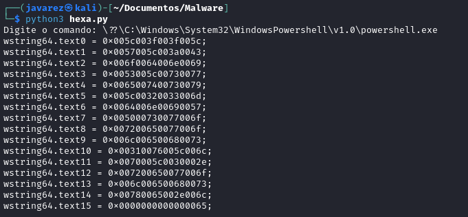

- Importante passar os "contrabarra", porque aqui é um identificador do kernel
- Agora é incluir no código:

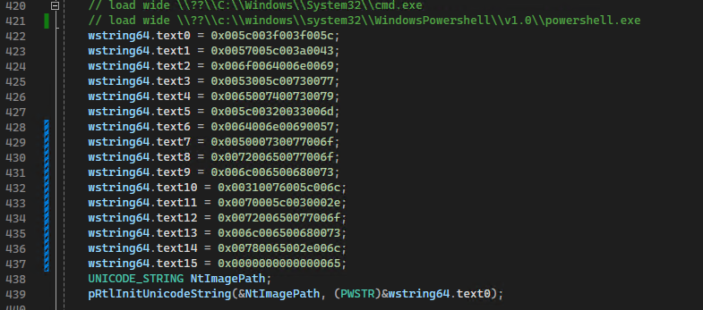

- É preciso fazer o mesmo para a linha que contém `// load wide \\??\\C:\\Windows\\System32\\cmd.exe /k msg * Hello from Dirty Vanity`. Porém aqui temos algumas alterações. É preciso notar que aqui o tipo de string é `wstring136`, assim fazemos o uso do `hexa.py` e alteraremos via `sed` esta string

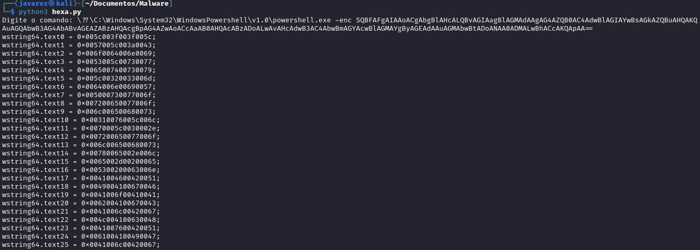

- Note, aqui foi utilizado o `powershell -enc <bas64-redacted>`, isso é para evitar acentos e pode ser gerado com:

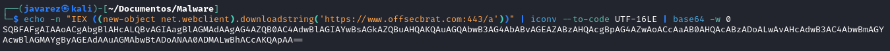

- Para gerar este arquivo que está no `/a` foi feita a criação de um Scripted Web Delivery no Cobalt Strike

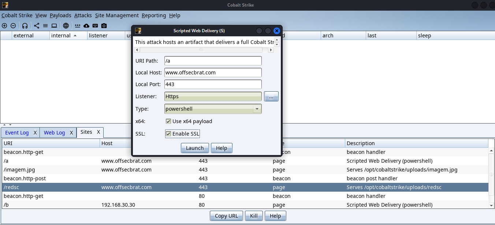

- Agora, para facilitar, eu salvo este conteúdo que sai com a string `64` em um arquivo e uso o `sed` para transformar em `136`:

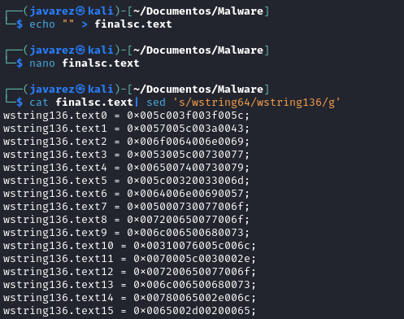

- Com o formato correto, jogamos no arquivo do Dirty Vanity
- Agora é preciso arrumar a linha acima

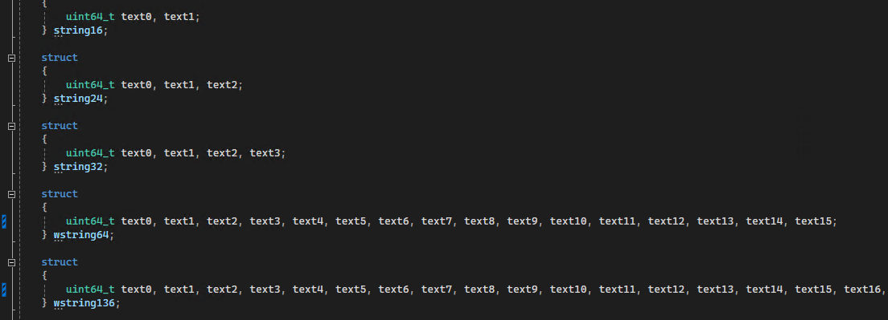

- Aqui é preciso colocar tantos `textn` quantos forem gerados no seu comando. Para mim, precisei colocar do `text10` até o `text71`. Para isto, é possível usar o comando abaixo:

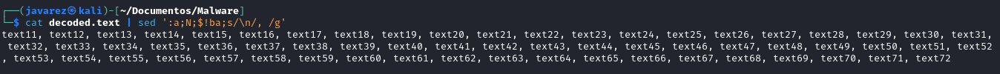

- Agora é hora de gerar o shellcode

### Compilação e shellcode

- Esta parte é similar ao video: [Position Independent Shellcode](https://www.youtube.com/watch?v=4spiZScwCOU) então ele pode ser seguido para melhor entendimento, porém segue também documentado
- Setar o Breakpoint nesta função, para ficar mais fácil visualizar o assembly depois

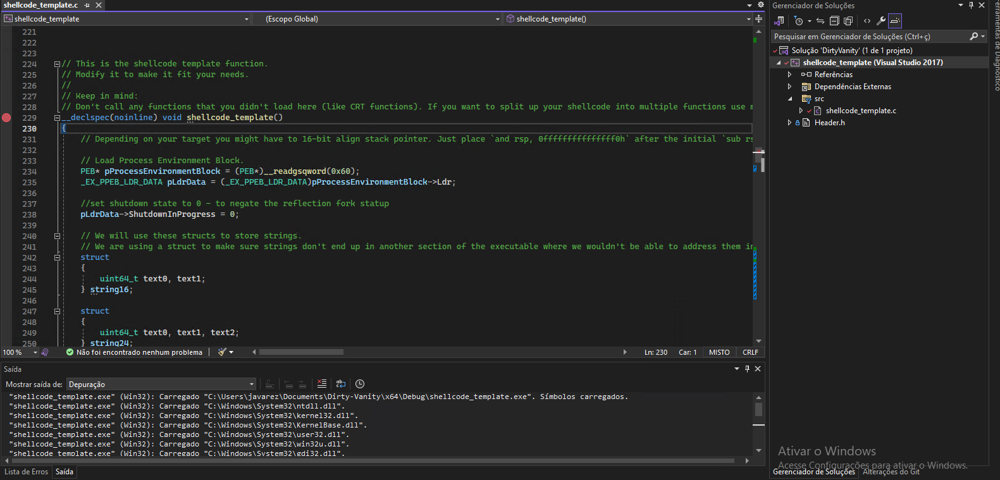

- Compilar o projeto do shellcode_template
- Agora é preciso Debugar para que seja possível ver o Assembly
- Para isso clicar no menu Depurar e depois clicar em Intervir:

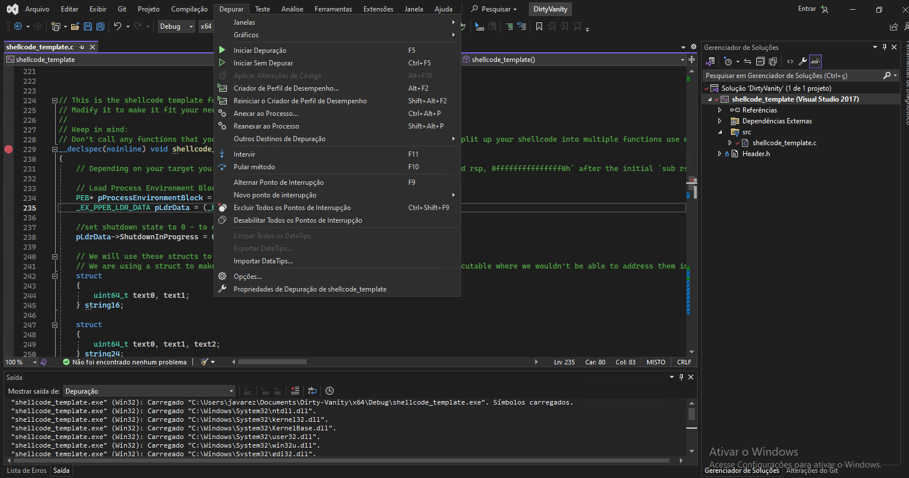

- Agora pressionar CTRL + ALT + D:

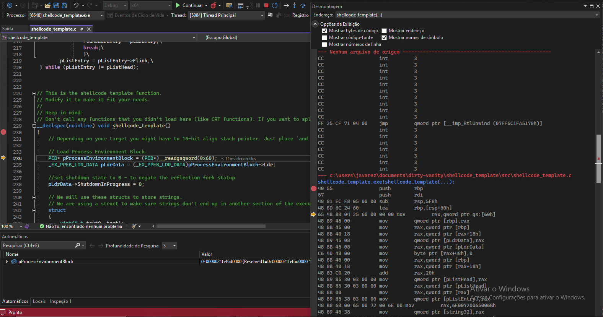

- Encontrar a função do shellcode pelo Breakpoint
- Agora é sugerido que esse código seja copiado para um notepad, para ficar mais fácil a visualização

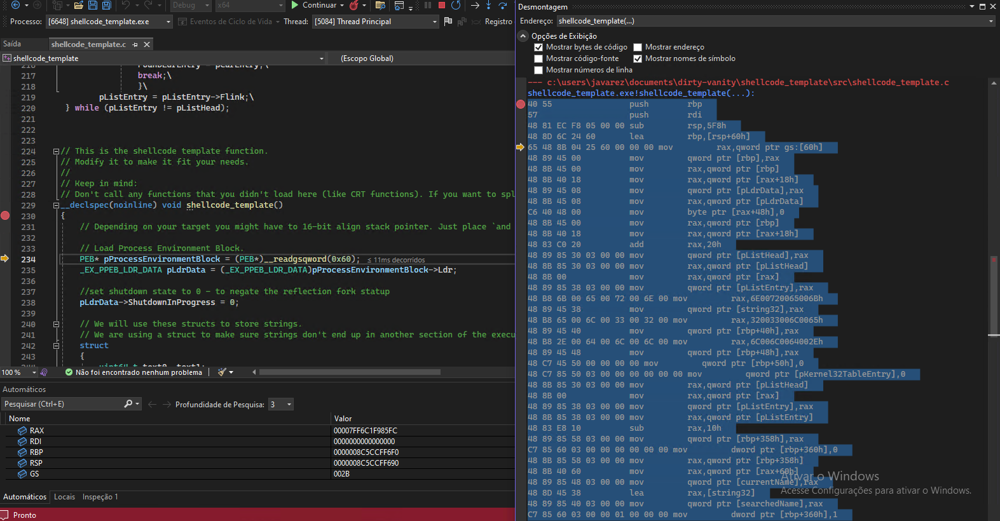

- Para pegar o shellcode completo do binário compilado, usar o `CFF Explorer`
- Abrir o programa e inserir nosso binário compilado:

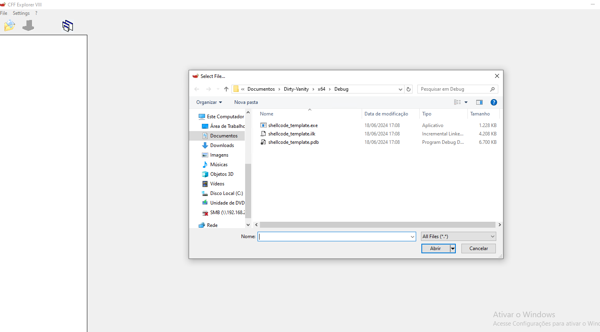

- Com o programa attachado, seguir a imagem abaixo para encontrar o `.text`

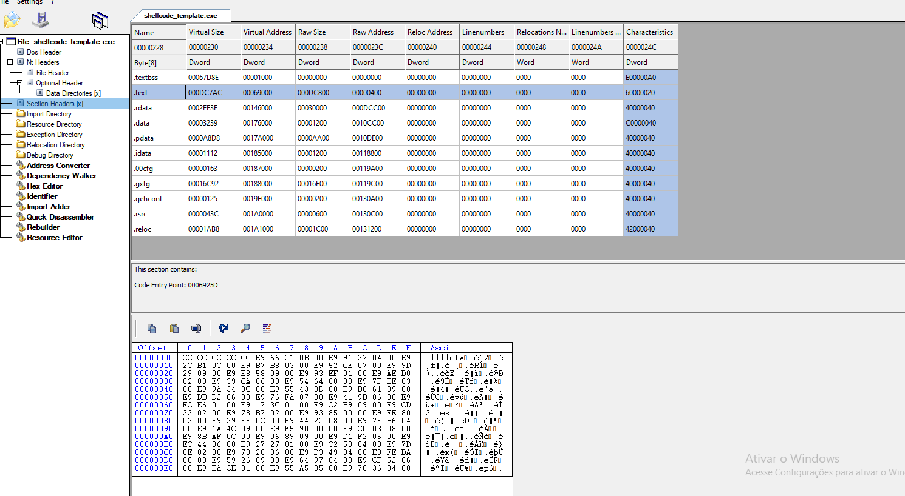

- Agora precisamos copiar os hexas do `.text` e jogar em um notepad:
- Clicar em Select All na imagem abaixo:

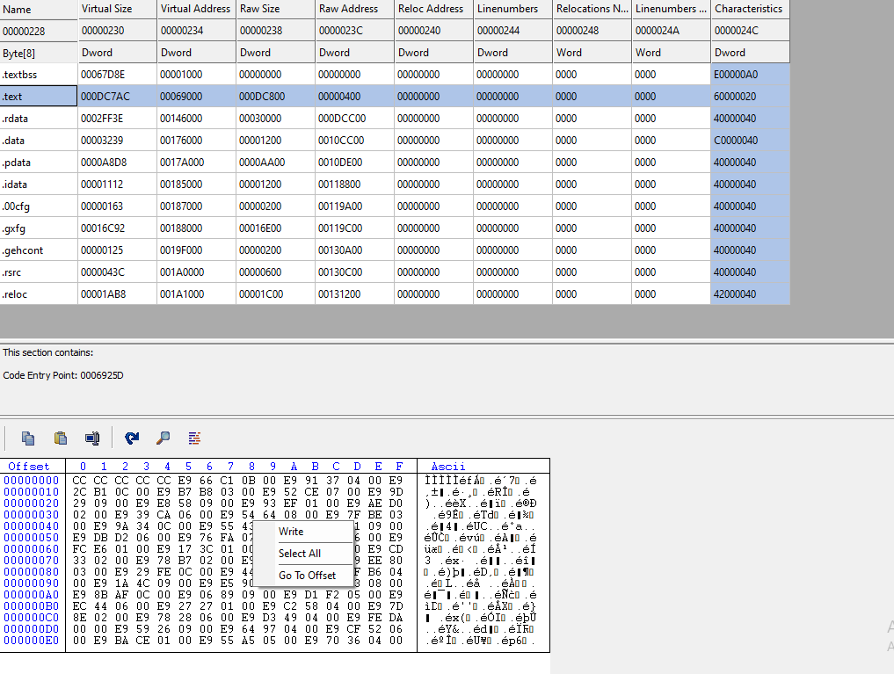

- Clicar em copy > C/C++ Array

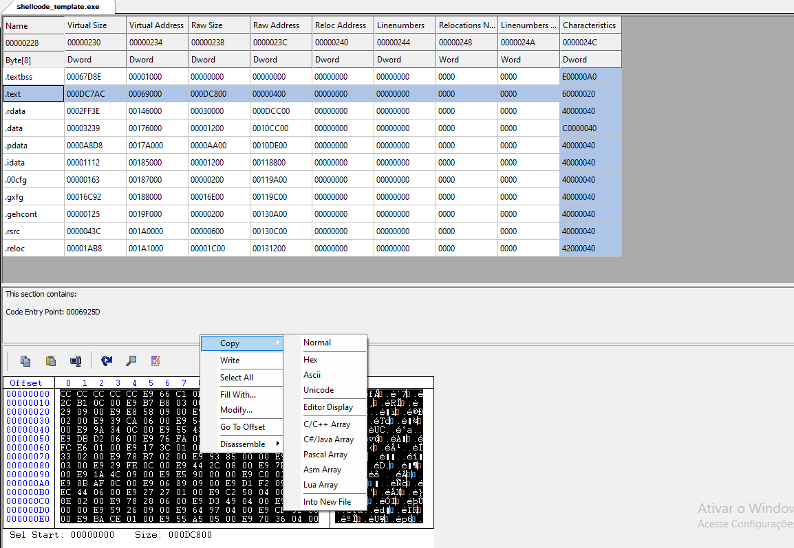

- Colar em um notepad
- É preciso encontrar os bytes que iniciam a função `shellcode_template`, então seguir os passos abaixo:

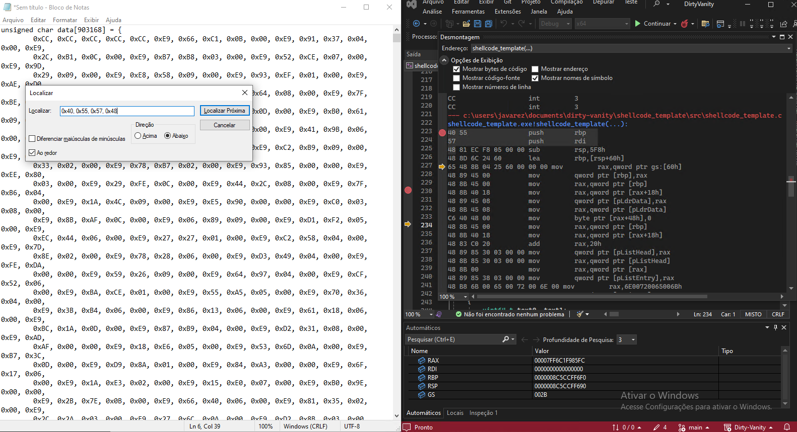

- Agora encontramos o final da função e selecionamos tudo acima dela (ou seja, somente o shellcode_template):

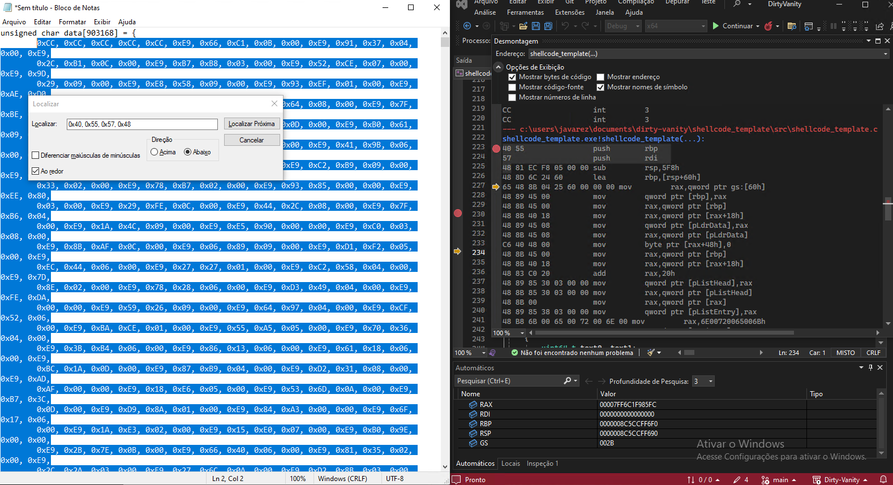

- Com isto, podemos copiar todo o shellcode e transferir para nosso Kali, onde usaremos o `criptoxor`
- No kali, criar o arquivo sc.c contendo o shellcode
- Rodar o `criptoxor`

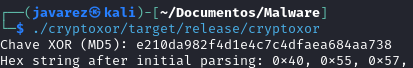

- Ele ira "cuspir" um arquivo `loader`. Então só precisamos transformar o loader em `redsc`

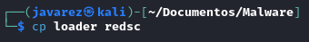

### Disclaimer: Agora mudou esta ultima parte, o nome deve ser redpic.
___

## Execução

- Transferir o arquivo para a máquina alvo:
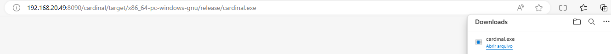

- Executar o `Cardinal` com um PID:

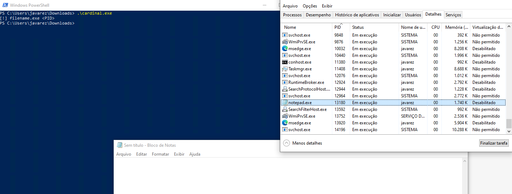

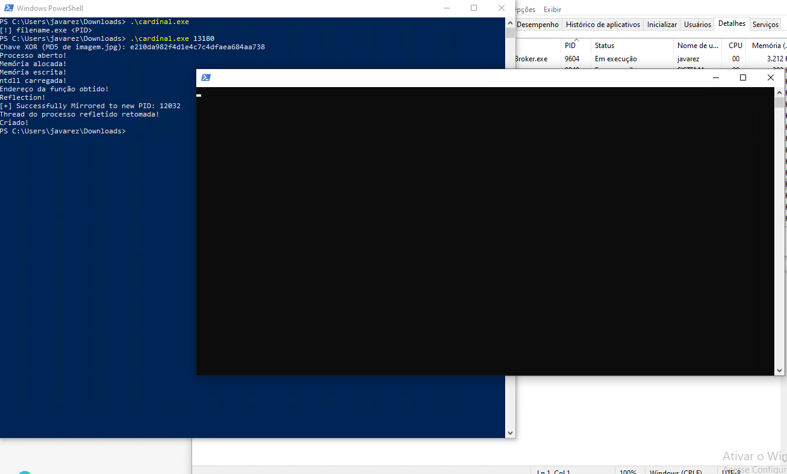

- E no Cobalt Strike:

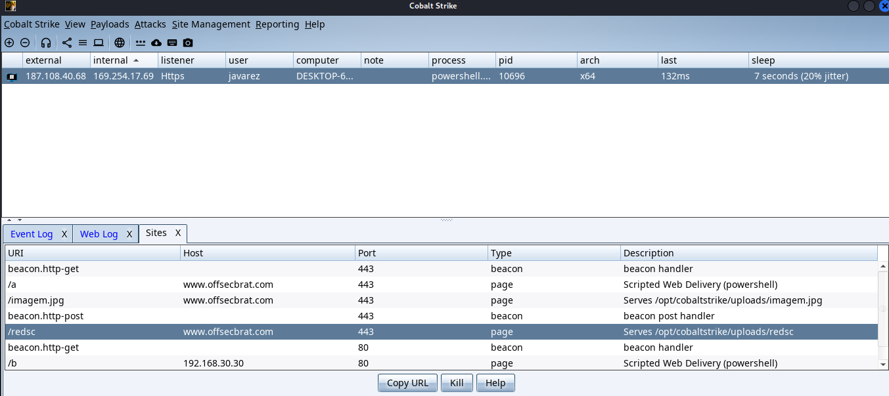
