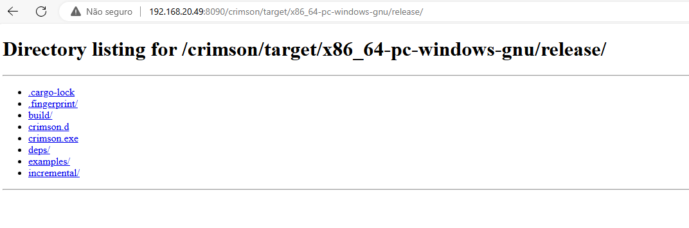
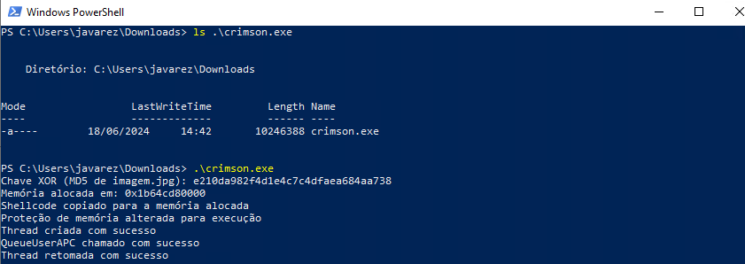
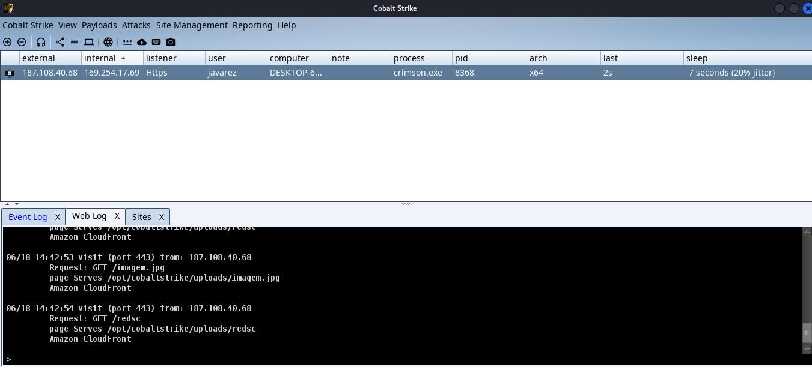

## Descrição
- Malware baseado em APC Injection
- Decoda um shellcode em xor (gerado pelo `criptoxor`) e executa em memória com QueueUserAPC

___

## Hospedagem

- Hospedar o shellcode (e a imagem, que é a mesma utilizada no `criptoxor`) na C2
- Para gerar o `redsc` é só copiar o arquivo `loader` com este nome. O arquivo loader é gerado pelo `criptoxor`

___

## Compilação

- Se o malware `Crimson` não estiver compilado, rodar:
  

- É comum que dê alguns alertas, mas não tem problema, porque compilará corretamente com a seguinte mensagem:

___
## Execução

- Com o malware compilado, basta mover para a máquina alvo e executar

