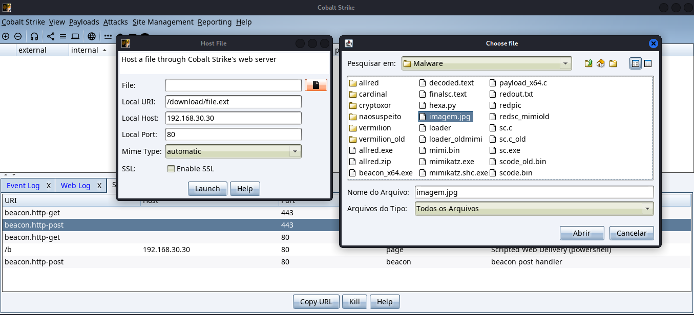
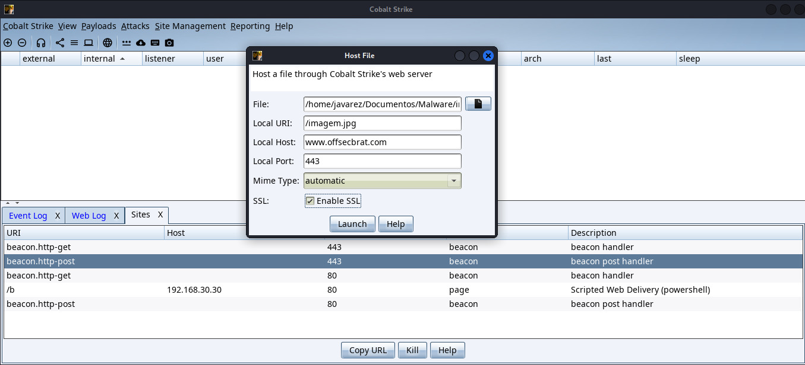
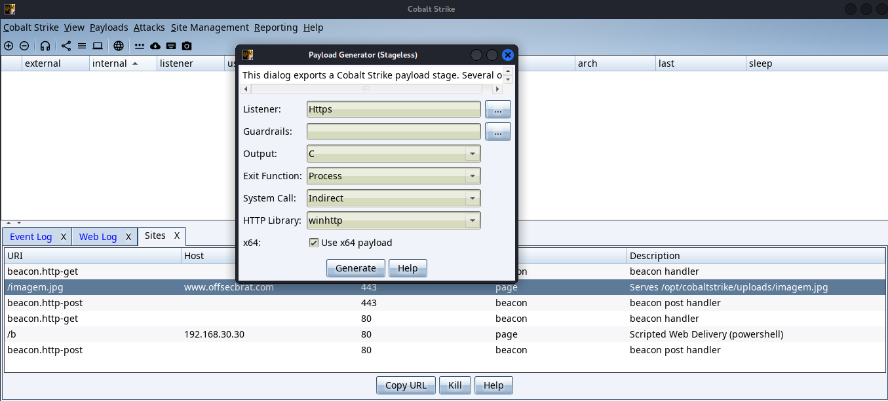
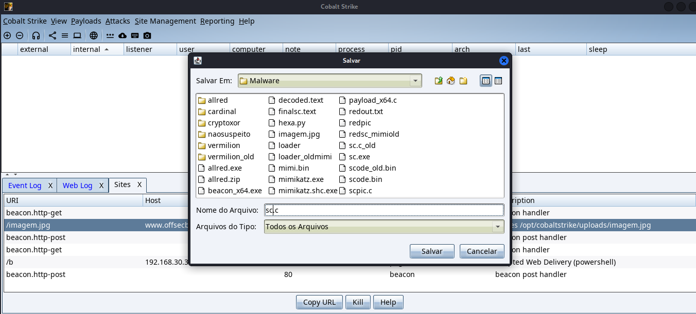
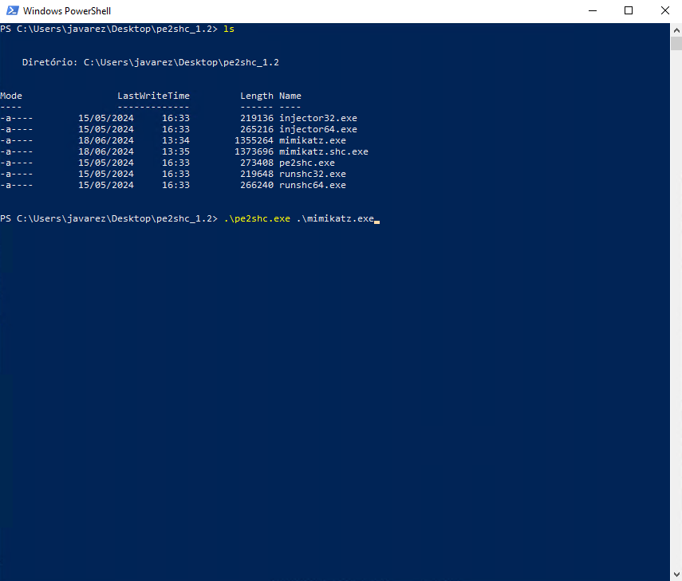
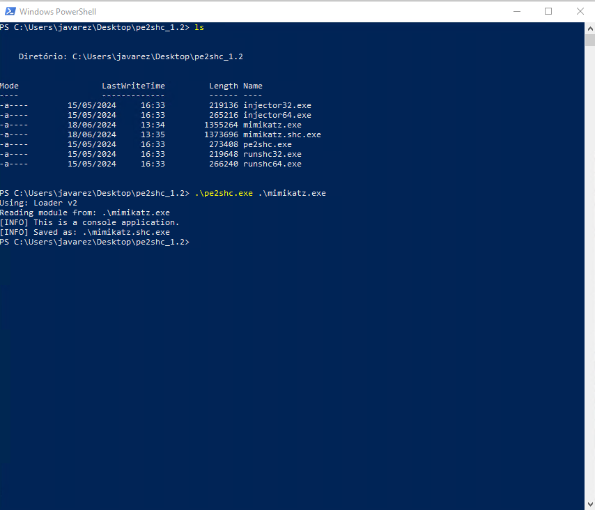
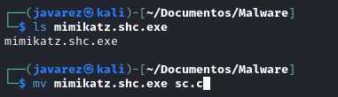
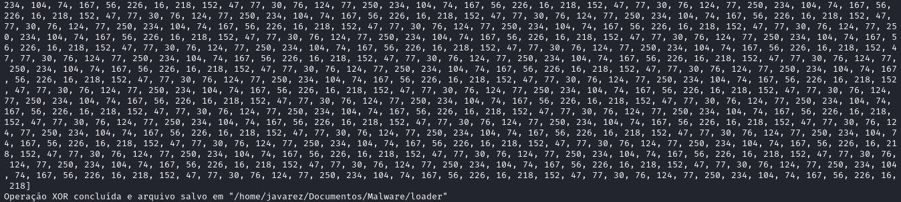

## Descrição

- Toda execução de malware tem como pré-requisito a execução de um shellcode. Com as técnicas mais modernas, é necessário que executemos este shellcode em memóra.
- Para isto, devemos optar por ofuscá-lo, e desofuscar em tempo de execução
- Temos algumas formas de fazer isto, mas aqui usaremos o `criptoxor.py`
- As opções que temos para isto é: Beacon do Cobalt ou PE_to_shellcode

___

## Shellcode

### Cobalt Strike

- Adicionar uma imagem (qualquer imagem) com o nome imagem.jpg no servidor do Cobalt Strike





- Baixar um shellcode do Cobalt Strike no formato Stageless Payload, com o Output no formato C



- Salvar no local indicado no `cryptoxor.py` com o nome `sc.c`



### PE to Shellcode

- Para usar o PE_to_shellcode, é preciso clonar o repositório em um máquina Windows e seguir as instruções de compilação. Também é possível pegar o arquivo Release. Link: [PE_to_shellcode](https://github.com/hasherezade/pe_to_shellcode)
- Agora, transfira o PE (executável) para a máquina windows e rode `pe2shc.exe <executavel> <output>`. Aqui farei o exemplo com o mimikatz.




- Agora transfira o arquivo gerado para a máquina kali e mova para `sc.c`



___

### Criptoxor

- Basicamente, para executar o `criptoxor.py` é preciso ter o arquivo `sc.c` na pasta e a `imagem.jpg` hospedada na C2
- Para executar, basta fazer: 

```bash
cargo build --release 

./cryptoxor/target/release/cryptoxor
```

- Se estiver feito corretamente, o output será este:

  

- Agora seu shellcode está pronto para ser utilizado nos malwares `Vermilion` e `Crimson`

