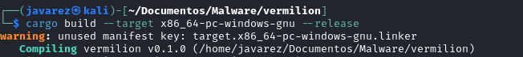
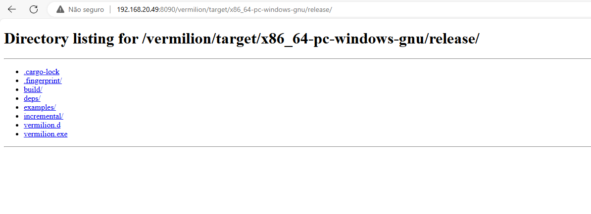
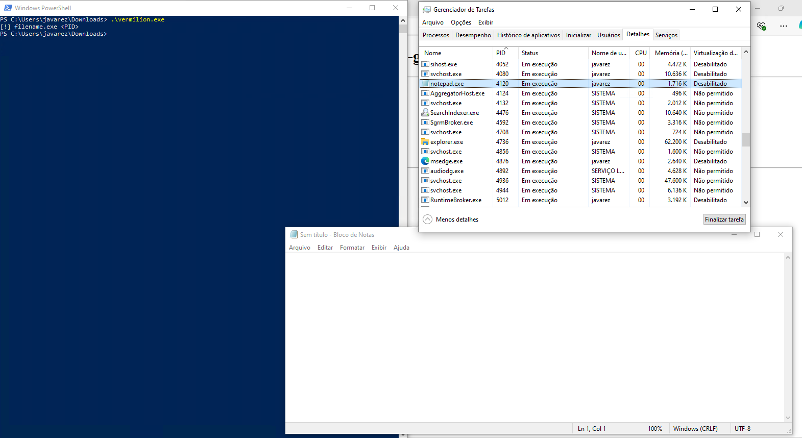
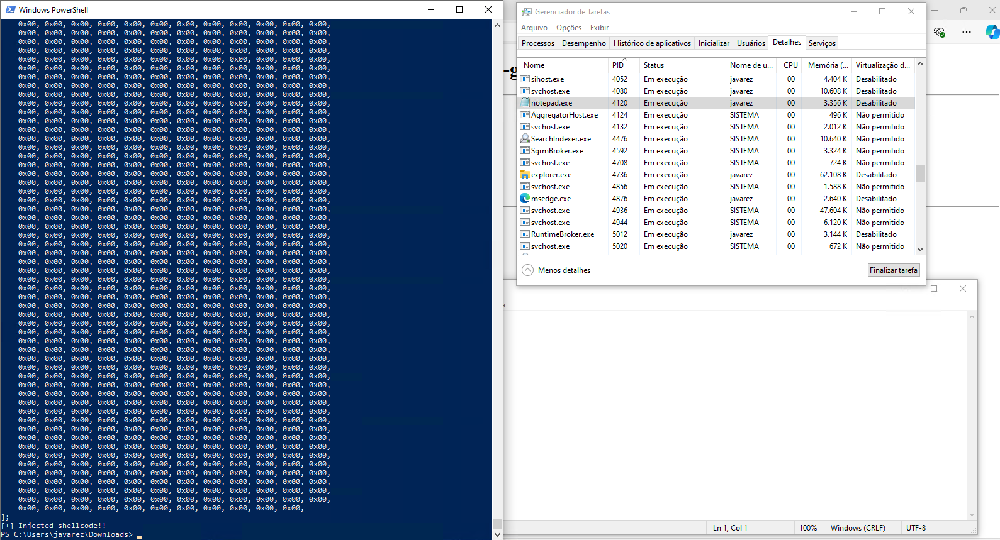
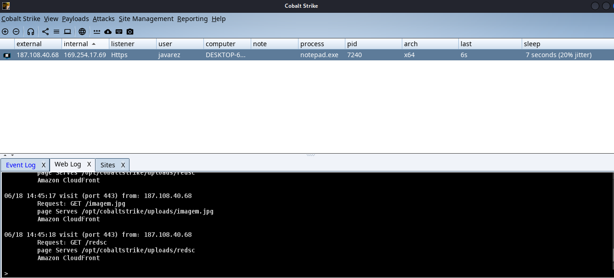

## Descrição

- Malware baseado em [Vectored Exception Handler](https://cyberwarfare.live/bypassing-av-edr-hooks-via-vectored-syscall-poc/)
- Ele decodará o shellcode `redsc` com a `imagem.jpg` e injetará o shellcode em memória, utilizando a técnica mencionada acima

___

## Hospedagem

- Hospedar o shellcode (e a imagem, que é a mesma utilizada no `criptoxor`) na C2
- Para gerar o `redsc` é só copiar o arquivo `loader` com este nome. O arquivo loader é gerado pelo `criptoxor`

___
## Compilação

- Se o malware `Vermilion` não estiver compilado, rodar:

- É comum que dê alguns alertas, mas não tem problema, porque compilará corretamente com a seguinte mensagem:

___

## Execução

- Com o malware compilado, é só transferi-lo para a máquina alvo e executar com um PID de algum processo:

